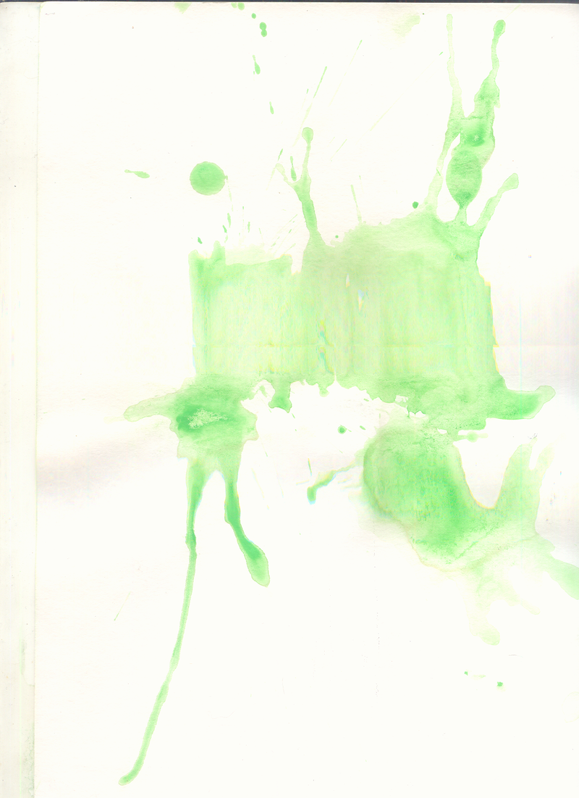
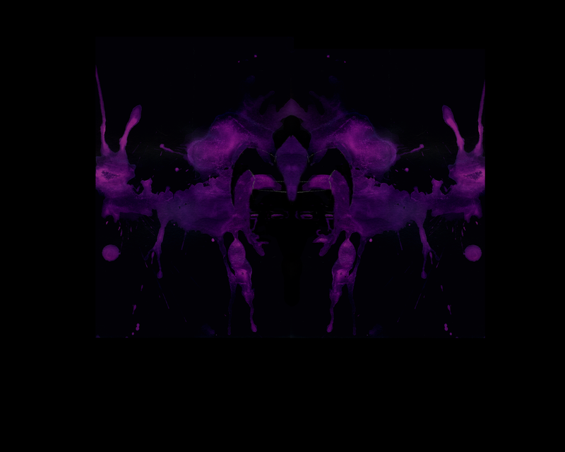
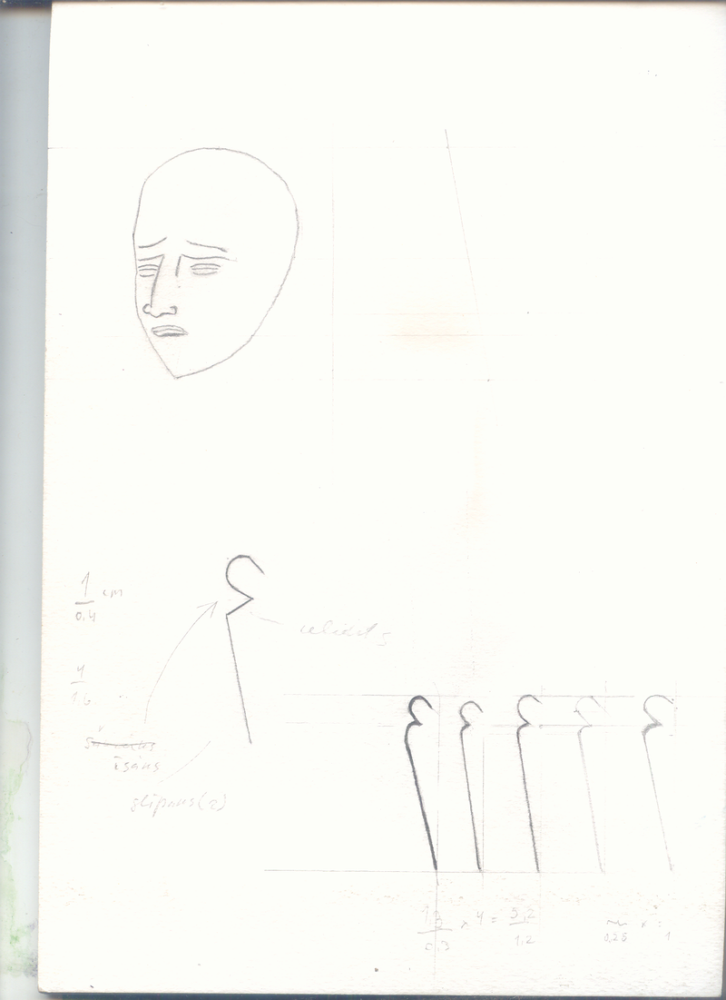

# 2008 logos for doom metal band "Enema Express"

#### rentgen/800x/plausu rentg  1

#### rentgen/800x/1 plausu rentg

#### kafka/800x/skice3.psd

#### kafka/800x/skice

#### kafka/800x/skice3 copy

#### kafka/800x/skice4.psd

#### kafka/800x/red

#### txt/800x/lpp3

#### txt/800x/burtu virknejums

#### txt/800x/02

#### txt/800x/01

#### txt/800x/a

#### txt/800x/dva

#### txt/800x/ras_adin

#### txt/800x/1 burtu virknejums

#### txt/800x/lpp1

#### txt/800x/ras_adin_CUT

#### txt/n/800x/Nnnn 2 1

#### txt/n/800x/Nnnn 1

#### txt/n/800x/Nnnn 2 CUT

#### txt/n/800x/Nnnn 1 CUT

#### 33/800x/unte2

#### 33/800x/3h

#### 33/800x/33 1

#### 33/800x/enema pliknis

#### 33/800x/unte

#### 33/800x/3 11

#### 33/800x/3 12

#### ink/black/800x/di08

#### ink/black/800x/d08

#### ink/black/800x/02

#### ink/black/800x/d07

#### ink/black/800x/di09

#### ink/black/800x/04

#### ink/black/800x/09

#### ink/black/800x/03

#### ink/black/800x/di07

#### ink/black/800x/di06

#### ink/black/800x/di05

#### ink/black/800x/di02

#### ink/black/800x/d04

#### ink/black/800x/d09

#### ink/black/800x/07

#### ink/black/800x/08

#### ink/black/800x/06

#### ink/black/800x/d05

#### ink/black/800x/05

#### ink/black/800x/d03

#### ink/black/800x/di04

#### ink/black/800x/d06

#### ink/green/3/800x/2H TRONIS TINTE 04

#### ink/green/3/800x/2H TRONIS TINTE 05

#### ink/green/3/800x/2H TRONIS TINTE 01

#### ink/green/3/800x/2H TRONIS TINTE 03

#### ink/green/3/800x/2H TRONIS TINTE 07

#### ink/green/3/800x/2H TRONIS TINTE 06

#### ink/green/2/800x/02

#### ink/green/2/800x/01

#### ink/green/2/800x/1 03

#### ink/green/2/800x/011 1

#### ink/green/1/800x/001

#### ink/green/1/800x/002

#### ink/green/0/800x/1

#### ink/green/0/800x/2

#### ink/green/0/800x/6

#### ink/green/0/800x/1 cut

#### ink/green/0/800x/7

#### ink/green/0/800x/4

#### ink/green/0/800x/pilieni 1

#### ink/purple/800x/Duplicate State 2

#### ink/purple/800x/Duplicate State 3

#### ink/purple/800x/Duplicate State 5

#### ink/purple/800x/enema altern project

#### ink/purple/800x/Duplicate State

#### ink/purple/800x/2H TRONIS TINTE 02

#### ink/purple/800x/Duplicate State 4

#### ink/800x/gray

#### teeth/800x/lpp4

#### head/hat/800x/TRONIS GRAY

#### head/hat/800x/3h dzo 4

#### head/hat/800x/TRONIS GRAY C

#### head/hat/800x/3h dzo 3

#### head/hat/800x/TRONIS

#### head/hat/800x/3h dzo 2

#### head/hat/800x/3h dzo 5

#### head/pen/800x/02ink

#### head/pen/800x/inkubator

#### head/1/800x/2H TRONIS 3

#### head/1/800x/dzokers 1

#### head/1/800x/a

#### head/1/800x/2h

#### head/1/800x/dzokers 4 cut

#### head/1/800x/2H TRONIS CUT

#### head/1/800x/3

#### head/1/800x/2H

#### head/1/800x/3h dzo 9

#### head/1/800x/2H TRONIS 2

#### head/1/800x/dzokers 4

#### head/1/800x/33 11

#### head/1/800x/3h dzo sad 2

#### head/1/800x/dzokers 3

#### head/1/800x/3h dzo sad 3

#### head/1/800x/2H TRONIS

