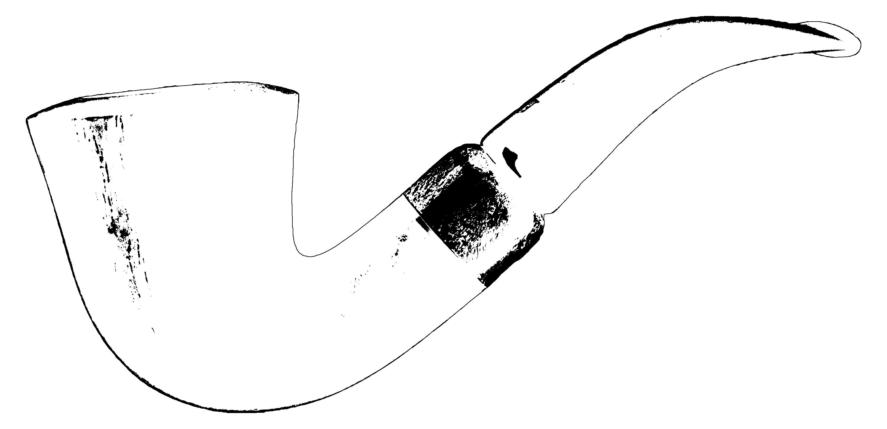
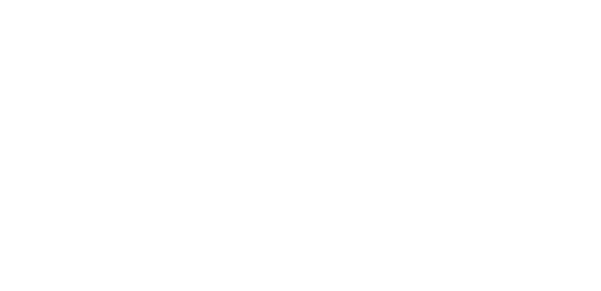
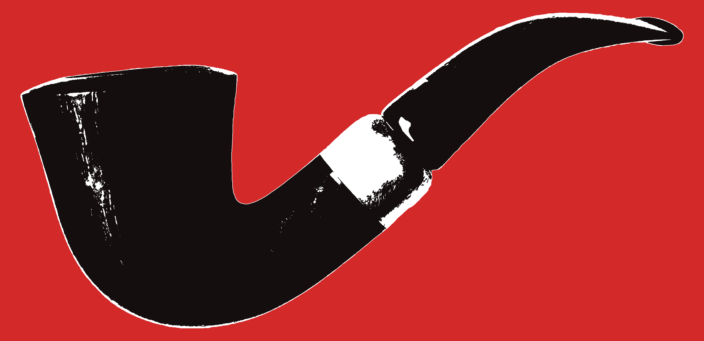
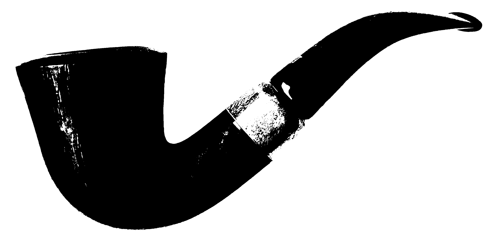
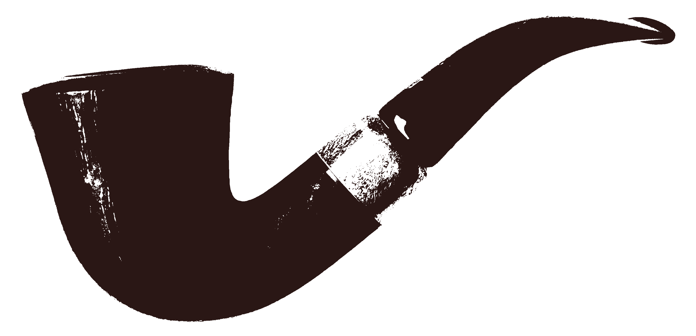
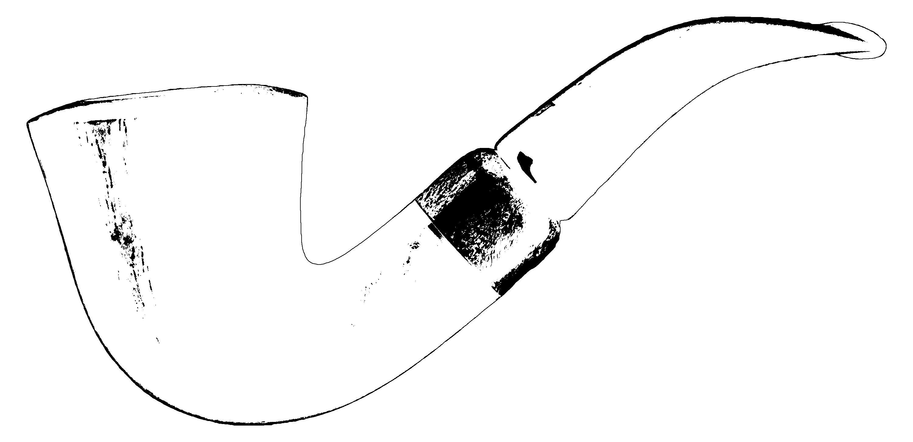
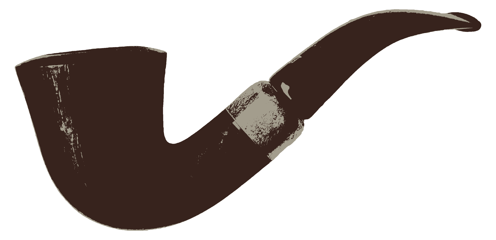
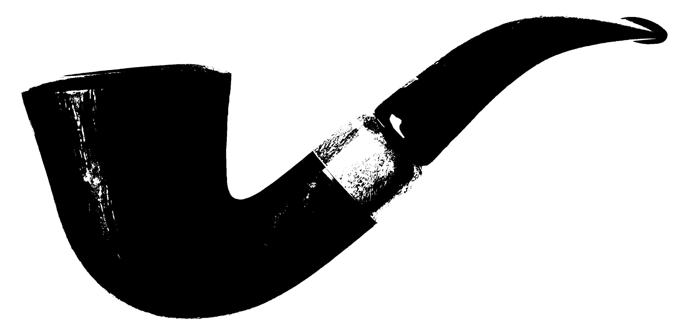
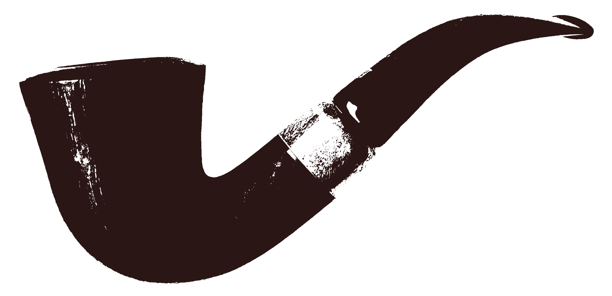
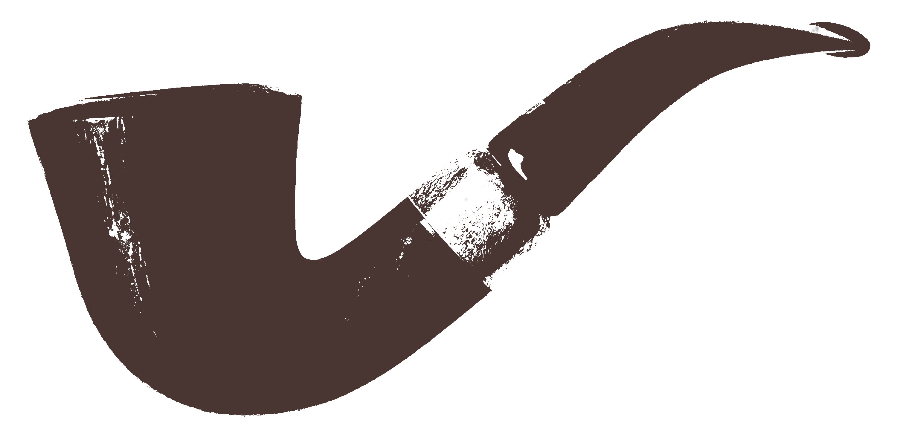

# 20180305 logos for [Dzhim CMS](https://github.com/janis-rullis/dzhim-cms)

#### images/3000x1452/contour/black

#### images/3000x1452/contour/white

#### images/3000x1452/bg colored/red black

#### images/3000x1452/contour bg colored/black

#### images/3000x1452/contour bg colored/brown 2

#### images/3000x1452/contour bg colored/white

#### images/3000x1452/contour bg colored/brown

#### images/3000x1452/bg transparent/black

#### images/3000x1452/bg transparent/brown 2

#### images/3000x1452/bg transparent/white

#### images/3000x1452/bg transparent/brown

#### images/33x16 gray

#### images/250x/contour/black

#### images/250x/contour/white

#### images/250x/bg colored/red black

#### images/250x/contour bg colored/black

#### images/250x/contour bg colored/brown 2

#### images/250x/contour bg colored/white

#### images/250x/contour bg colored/brown

#### images/250x/bg transparent/black

#### images/250x/bg transparent/brown 2

#### images/250x/bg transparent/white

#### images/250x/bg transparent/brown

