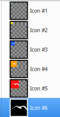

# 20180315 gulls for https://janis-rullis.github.io/kaijas/window.html

#### favicon/favicon 16

#### favicon/favicon 128

#### favicon/favicon 96

#### favicon/favicon 64

#### favicon/multi color for size test/favicon 16

#### favicon/multi color for size test/64 add to desktop

#### favicon/multi color for size test/png layers in ico

#### favicon/multi color for size test/favicon 128

#### favicon/multi color for size test/32 on desktop

#### favicon/multi color for size test/256 in folder

#### favicon/multi color for size test/favicon 96

#### favicon/multi color for size test/favicon 64

#### favicon/multi color for size test/16 browser

#### favicon/multi color for size test/favicon 256

#### favicon/multi color for size test/favicon 32

#### favicon/favicon 256

#### favicon/favicon 32

