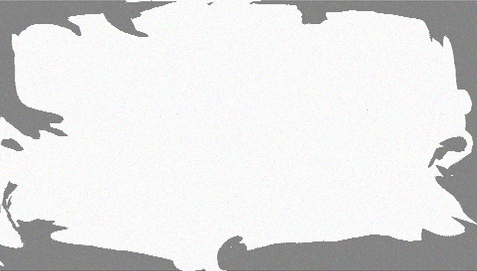

# 20180316 dreams for https://janis-rullis.github.io/kaijas/bed.html

#### borders/3 blurred/11

#### borders/3 blurred/15

#### borders/3 blurred/6 1

#### borders/3 blurred/14

#### borders/3 blurred/7 1

#### borders/3 blurred/13

#### borders/3 blurred/2 1

#### borders/3 blurred/4 1

#### borders/3 blurred/12

#### borders/3 blurred/9

#### borders/3 blurred/3 1

#### borders/3 blurred/8

#### borders/3 blurred/10

#### borders/3 blurred/5 1

#### borders/2 smudged/5

#### borders/2 smudged/2

#### borders/2 smudged/11

#### borders/2 smudged/6

#### borders/2 smudged/15

#### borders/2 smudged/14

#### borders/2 smudged/3

#### borders/2 smudged/13

#### borders/2 smudged/12

#### borders/2 smudged/9

#### borders/2 smudged/7

#### borders/2 smudged/4

#### borders/2 smudged/8

#### borders/2 smudged/10

#### borders/1 foggy/2

#### borders/1 foggy/3

#### borders/1 foggy/4

